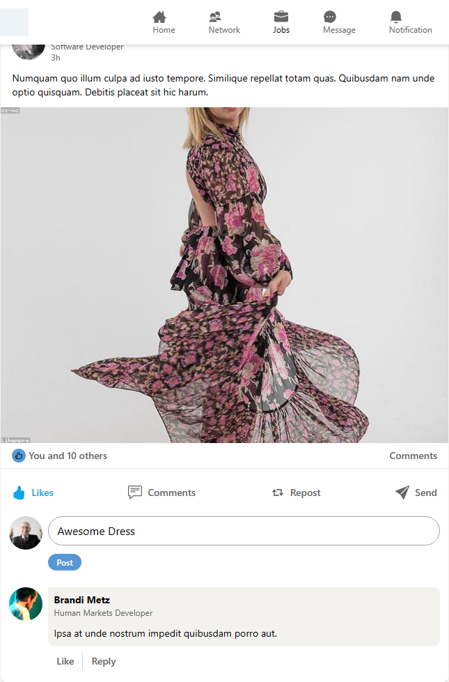
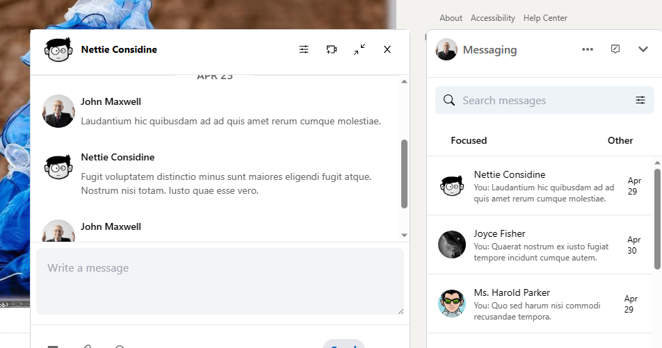

# LinkedIn Clone
This project is a clone of the LinkedIn website, built with React, tailwind css, Redux and faker.js.

## Table of Contents
- Installation
- Usage
- Features
- Contributing
- License

## Installation
To install the project dependencies, run the following command:

npm install

The server will start on http://localhost:3000.

To build the project for production, run the following command:

npm run build

The production-ready files will be generated in the build directory.

## Main Features
- News feed with posts and comments
    - Posts section uses Redux to manage state changes and handle post likes and comments
    - Fake data generated using Faker.js library
    

- Messaging between users
    - Ability to see and manage individual messages
    

## Contributing
Contributions are welcome! To contribute to the project, follow these steps:

1. Fork the repository
2. Create a new branch for your feature or bug fix
3. Make your changes and commit them with descriptive commit messages
4. Push your changes to your fork
5. Create a pull request to merge your changes into the main repository

## License
This project is licensed under the MIT License.

